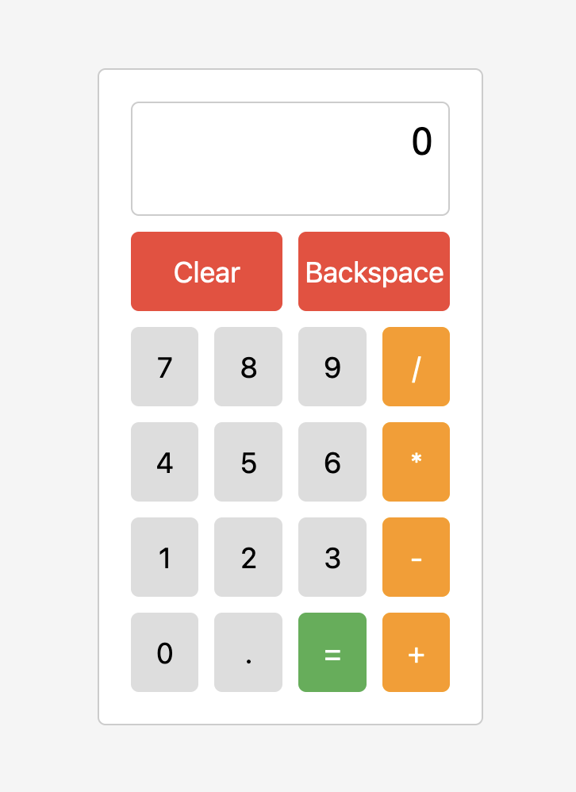

# Project: Calculator

Calculator that can do basic operations. 

Link: https://xsparko.github.io/Project-Calculator/

Features:

- It accepts input from keyboard or button clicks. 
- User can put a decimal, but numbers are limited to 2 decimal points.
- When user tries to divide number by 0, calculator will display an error warning that it's not possible. 
- Functional clear, equals and backspace buttons. 
- Answers with long decimals are automaticly rounded.

My Calculator has a simple UI. Here's how it looks:

---
This project was possible thanks to [The Odin Project.](https://www.theodinproject.com/)  
As I finished project: Calculator on 2024-03-14, it marks my finish of the Foundation Course. 